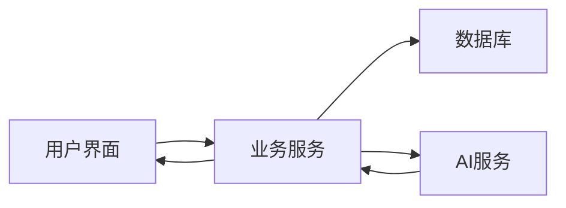
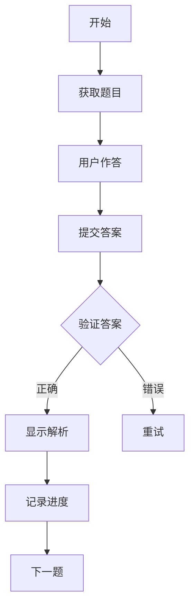

# 系统架构文档

## 整体架构

MySQL练习系统采用分层架构设计，主要包含以下层次：

1. 表现层（UI Layer）
   - 基于 PyQt6 构建的图形界面
   - 响应式布局设计
   - 主题切换支持

2. 业务层（Service Layer）
   - 题目管理服务
   - 用户进度服务
   - 评分服务
   - AI 服务集成

3. 数据层（Data Layer）
   - MySQL 数据库
   - 缓存系统
   - 文件存储

## 核心组件

### UI 组件
```
src/ui/
├── components.py      # 可重用UI组件
├── main_window.py     # 主窗口
└── widgets/           # 自定义控件
    ├── question_widget.py
    ├── answer_widget.py
    └── statistics_widget.py
```

### 业务服务
```
src/services/
├── question_service.py     # 题目管理
├── user_service.py        # 用户管理
├── scoring_service.py     # 评分服务
└── deep_learning_manager.py # AI服务
```

### 数据访问
```
src/database/
├── db_manager.py      # 数据库管理
├── cache_manager.py   # 缓存管理
└── models/           # 数据模型
```

## 数据流

1. 用户操作流程


2. 答题流程


## 关键技术

1. 前端技术
   - PyQt6 框架
   - 自定义控件
   - 事件处理系统

2. 后端技术
   - Python 3.8+
   - MySQL 8.0
   - DeepSeek API

3. 部署技术
   - Docker 容器化
   - Docker Compose 编排
   - SSL 安全传输

## 安全设计

1. 数据安全
   - 数据库加密存储
   - SSL 安全连接
   - 定期数据备份

2. 接口安全
   - 参数验证
   - 异常处理
   - 日志记录

3. 运行安全
   - 进程隔离
   - 资源限制
   - 错误恢复

## 扩展性设计

1. 模块化设计
   - 松耦合架构
   - 插件式扩展
   - 配置驱动

2. 性能优化
   - 数据库索引
   - 查询优化
   - 缓存机制

3. 可维护性
   - 统一编码规范
   - 完整文档
   - 自动化测试

## 部署架构

### 开发环境
```
[开发机] --> [Docker容器]
                ├── [应用容器]
                └── [数据库容器]
```

### 生产环境
```
[负载均衡] --> [应用集群]
                ├── [应用节点1]
                ├── [应用节点2]
                └── [应用节点n]
             --> [数据库集群]
                ├── [主节点]
                └── [从节点]
```

## 监控和维护

1. 系统监控
   - 性能指标
   - 错误日志
   - 用户行为

2. 数据维护
   - 定期备份
   - 数据清理
   - 索引优化

3. 系统更新
   - 版本控制
   - 平滑升级
   - 回滚机制

## 开发规范

1. 代码规范
   - PEP 8 编码规范
   - 类型注解
   - 文档字符串

2. 测试规范
   - 单元测试
   - 集成测试
   - 性能测试

3. 版本控制
   - Git 工作流
   - 语义化版本
   - 分支管理 